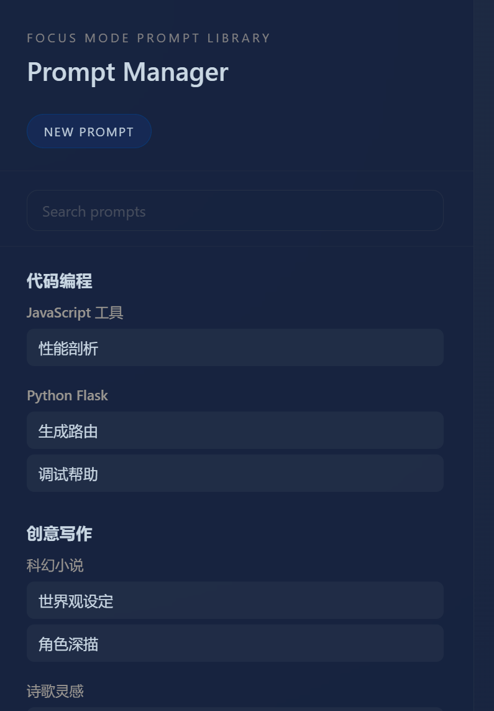

# Prompt Manager



A lightweight prompt library built with Flask for prompt engineers who value speed, keyboard-centric navigation, and a focused reading mode. The application organises prompts by domain and subtopic, delivers a responsive UI with instant search, and exposes a tested REST API for future integrations.

## Features
- Domain → subtopic → prompt hierarchy fetched in a single API call.
- Focus mode detail view with copy-to-clipboard, edit, and delete actions.
- Create and manage prompts through an accessible modal workflow.
- Debounced full-text search across titles and prompt bodies.
- Comprehensive pytest coverage for models and API endpoints.
- Seed script for quickly populating a development database.

## Tech Stack
- Python 3.12+
- Flask with the application factory pattern
- Flask-SQLAlchemy & SQLite (default) or any SQLAlchemy-supported database
- Vanilla JavaScript, HTML5, and CSS3
- Pytest for automated testing
- Gunicorn for production-serving the WSGI app

如需更深入的技术架构、API 设计和数据模型说明，请参阅 [PROJECT_TECH.md](PROJECT_TECH.md)。

## Getting Started

### 1. Clone & Create a Virtual Environment
```bash
python -m venv env_pm
source env_pm/bin/activate  # Windows: env_pm\Scripts\activate
```

### 2. Install Dependencies
```bash
pip install -r requirements.txt
```

### 3. Configure Environment
Set environment variables as needed before running the app:

- `SECRET_KEY`: Flask secret key (defaults to `dev`, but you should override in production).
- `DATABASE_URL`: SQLAlchemy database URI (defaults to a SQLite file inside the repository).

You can store these in a `.env` file and use a loader such as `python-dotenv`, or export them directly in your shell.

### 4. Initialise the Database
```bash
python seed.py
```
The seed script drops existing tables, recreates them, and inserts sample domains, subtopics, and prompts.

### 5. Run the Development Server
```bash
python run.py
```
The dev server reads configuration from `config.py` and serves the UI at `http://127.0.0.1:5000/`.

### 6. Execute the Test Suite
```bash
pytest
```
Pytest spins up an in-memory SQLite database, ensuring fast and reliable test runs.

## Deployment Notes
- Use Gunicorn (already listed in `requirements.txt`) to serve the app in production:
  ```bash
  gunicorn "app:create_app()" --bind 0.0.0.0:8000
  ```
- A simple `Procfile` is included for platforms like Heroku:
  ```
  web: gunicorn "app:create_app()"
  ```
- Configure `DATABASE_URL` to point at your production database. SQLite is great for local development but not recommended for concurrent production workloads.
- Set `SECRET_KEY` to a strong random string in production environments.

## Project Structure
```
prompt_manager/
├── app/
│   ├── __init__.py        # Flask application factory
│   ├── models.py          # SQLAlchemy models
│   ├── routes.py          # API + frontend routes
│   ├── static/
│   │   ├── css/
│   │   └── js/
│   └── templates/
├── backup_db/             # Stores database backups
├── config.py              # Configuration classes and defaults
├── run.py                 # Dev server entry point
├── run_backup.bat         # Backup execution script (Windows)
├── backup.py              # Core database backup logic
├── seed.py                # Database seeding script
├── tests/                 # Pytest suites
├── requirements.txt       # Locked dependencies including gunicorn
├── Procfile               # Production process definition
└── README.md
```

## Helpful Commands
- Reset and reseed the database:
  ```bash
  python seed.py
  ```
- Open a Flask shell with models pre-imported:
  ```bash
  flask --app run.py shell
  ```

## Contributing
1. Create a new branch for your feature or bugfix.
2. Write tests alongside code changes.
3. Run `pytest` before submitting a pull request.
4. Update documentation when behaviour changes.

Enjoy a frictionless focus mode for your prompt library!
